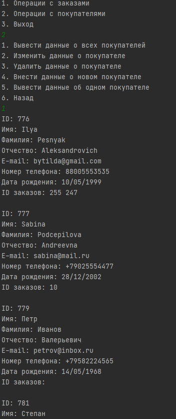

### SberTask

Использованная БД: MySQL

##Таблицы БД:
 Покупатели:
 

---
 Заказы:
 

##Небольшие пояснения
<li> Класс, отвечающий за соединение с БД был реализован по паттерну singleton
<li> Использованная схема разделения данных: 'MVC' с тонкой моделью
<li> Отвественность за генерацию уникальных значений идентификаторов была возложена на БД
  
 ##Примеры работы программы
 
 
 
